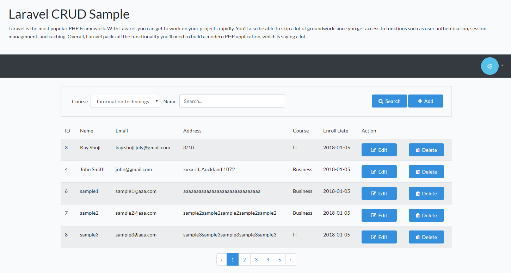

## About Laravel

Laravel is the most popular PHP Framework. With Lavarel, you can get to work on your projects rapidly. You’ll also be able to skip a lot of groundwork since you get access to functions such as user authentication, session management, and caching. Overall, Laravel packs all the functionality you’ll need to build a modern PHP application, which is saying a lot.

- [Simple, fast routing engine](https://laravel.com/docs/routing).
- [Powerful dependency injection container](https://laravel.com/docs/container).
- Multiple back-ends for [session](https://laravel.com/docs/session) and [cache](https://laravel.com/docs/cache) storage.
- Expressive, intuitive [database ORM](https://laravel.com/docs/eloquent).
- Database agnostic [schema migrations](https://laravel.com/docs/migrations).
- [Robust background job processing](https://laravel.com/docs/queues).
- [Real-time event broadcasting](https://laravel.com/docs/broadcasting).

Laravel is accessible, powerful, and provides tools required for large, robust applications.

## Sample

 

The application is CRUD Sample for Laravel beginners. It includes basic create, read, update and delete functions.

## Code

I added and modified following pages.

View
- sample/app/resources/views/students/create.blade.php
- sample/app/resources/views/students/edit.blade.php
- sample/app/resources/views/students/index.blade.php
- sample/app/resources/views/layout.blade.php

Controller
- sample/app/Http/Controllers/StudentController.php

Model
- sample/app/Student.php

Route
- sample/routes/web.php

Database
- sample/database/migrations/2019_08_04_231404_create_students_table.php

env
- sample/.env
